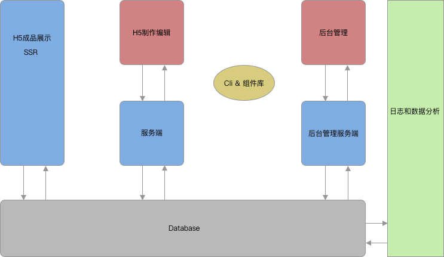

# 第一周作业-技术架构文档

## 需求分析
[需求文档](https://www.yuque.com/imooc-lego/zlz87z)

## 模块设计
### 业务功能模块
 * H5成品展示（SSR）
 * H5编辑
   - 前端
   - 后端
 * 后台管理系统
   - 前端
   - 后端
 * 日志及分析统计
   - PV/UV-百度
   - 自定义事件-自研

### 辅助模块
 * 脚手架
 * 通用组件库
 
 

## 扩展性
 * 扩展组件
 * 扩展编辑功能
 * auth2.0 微信淘宝微博登录

## 研发提效
 * Cli 创建，发布项目，统一代码规范
 * 通用组件平台，避免重复造轮子

## 运维保障
 * 安全 SSL证书
 * 监控警告 邮件提醒
 * 日志
